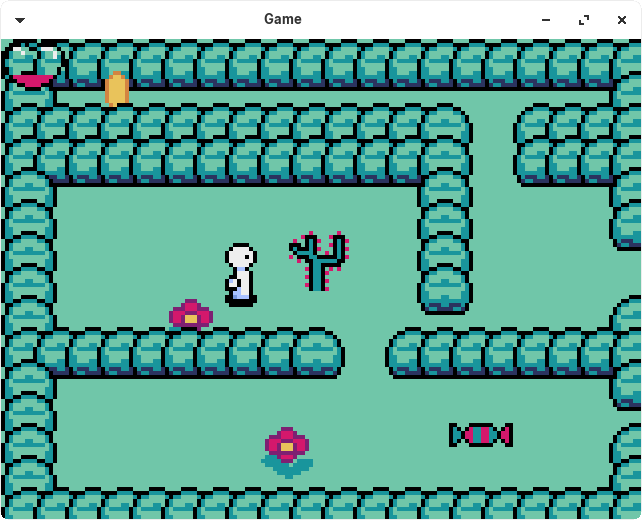

# pyxelSimpleGame
My first simple game with Pyxel

## Implemented
* Structure of classes
* Animation
* Some sprites
* Collision detection
* Srpite of character

## Todo
* Map mapping with tiles
* More sprites

