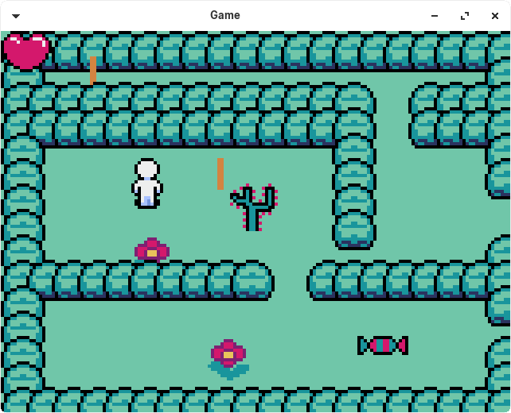

# pyxelSimpleGame
My first simple game with Pyxel

## Implemented
* Structure of classes
* Animation
* Some sprites
* Collision detection ++
* Sprite of character
* Footprint for better integration
* Map mapping with tiles

## Todo
* More sprites

